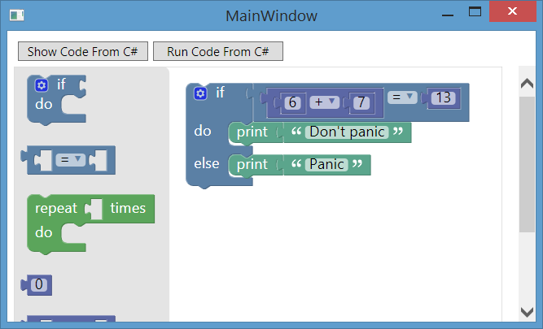

# Use Blocky in a Desktop Application

This example shows:

 - How you can load a toolbox dynamically
 - How you can load workspace dynamically
 - How you can call Blocky API methods using javascript methods. In the example you can see `showCode` and `runCode` proxy methods which are independent from wprkspace and will work with any workspace.  You can call javascript methods from C#.

You can use either of [Blocky Demos](https://blockly-demo.appspot.com/static/demos/index.html) for example. I created an example which shows using Blocky API methods and also using Blocky UI Tools. This example is based on [Generating Javascript](https://blockly-demo.appspot.com/static/demos/generator/index.html) example which shows how to use Blocky API to generate a javascript from Blocky workspace.